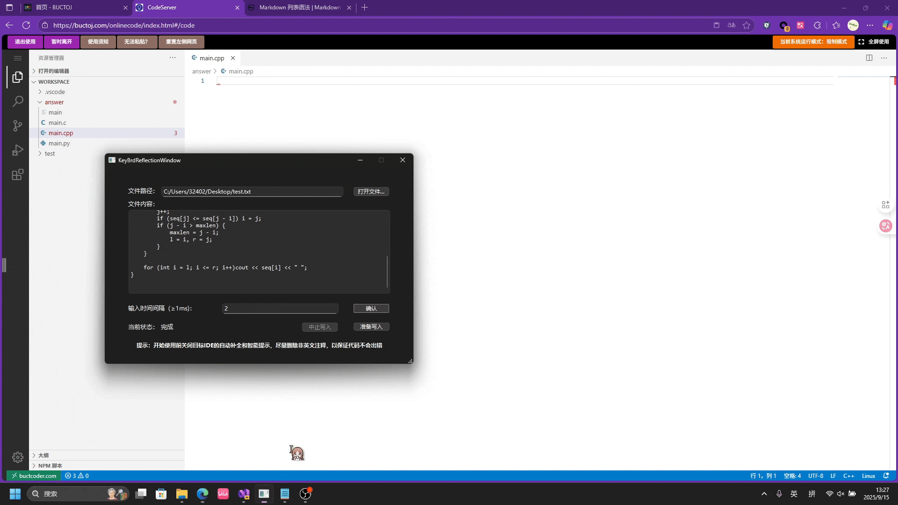

# 用途
学校服务器部署的VSCode不允许直接从剪贴板粘贴内容，此软件通过调用Windows API的虚拟键盘来间接实现粘贴



[视频介绍](https://www.bilibili.com/video/BV1goYwzZEN3)

# 使用方法
本软件为命令行程序，只有一个参数，传入文件路径即可。

**示例（终端）：**
```
Keyboard_reflection D:/targetfiles.txt
```
调用命令后，会有三秒时间允许用户及时将光标切换到工作区，随后执行虚拟键盘映射

# 特别提示
碍于本人技术力不足，本软件UI由我的舍友（协作者）使用AI开发，仅核心功能由纯人工写成。

关于此项目的屎山代码分析：参见此[issue](https://github.com/Done-0/fuck-u-code/issues/2#issuecomment-3271347973)

>屎山代码分析[项目地址](https://github.com/Done-0/fuck-u-code)

