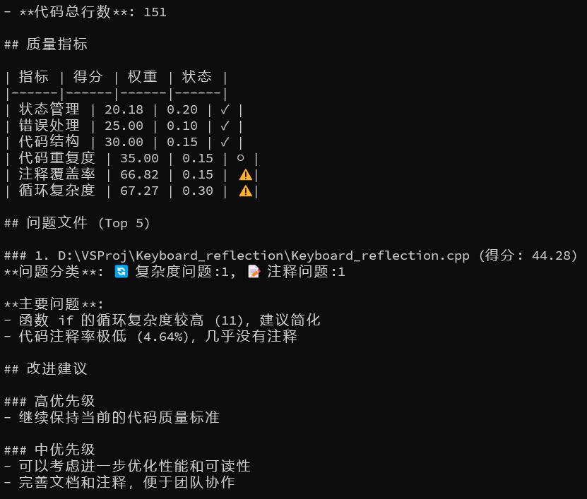

# 用途
学校服务器部署的VSCode不允许直接从剪贴板粘贴内容，此软件通过调用Windows API的虚拟键盘来间接实现粘贴


[视频介绍](https://www.bilibili.com/video/BV1goYwzZEN3)

# 使用方法
本软件为命令行程序，只有一个参数，传入文件路径即可。

**示例（终端）：**
```
Keyboard_reflection D:/targetfiles.txt
```
调用命令后，会有三秒时间允许用户及时将光标切换到工作区，随后执行虚拟键盘映射

# 更新计划
碍于本人技术力不足，目前的用户图形界面由我的舍友使用AI开发。后续会更新一个本人手写的UI。


# PS
代码[史山程度分析](https://github.com/Done-0/fuck-u-code)（25/9/9 v1.0）



